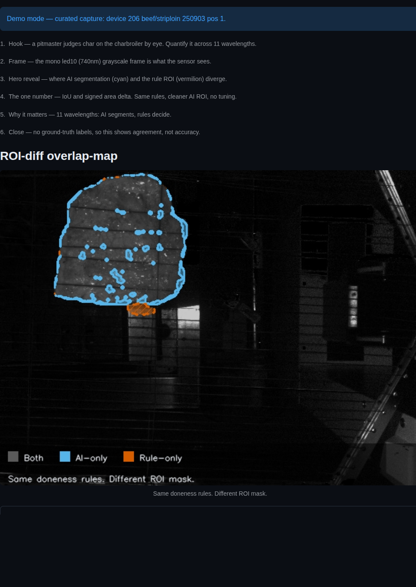
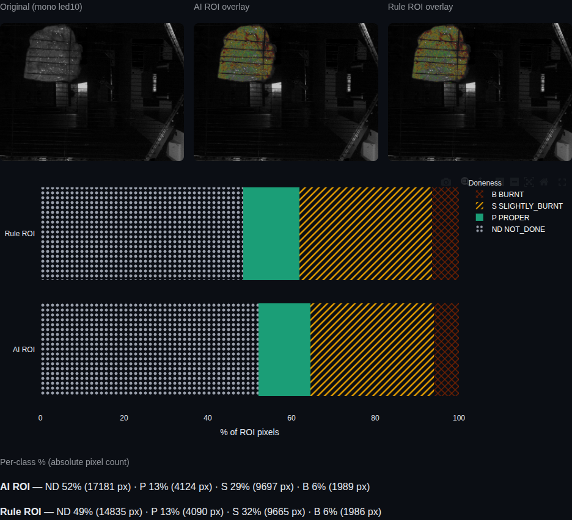
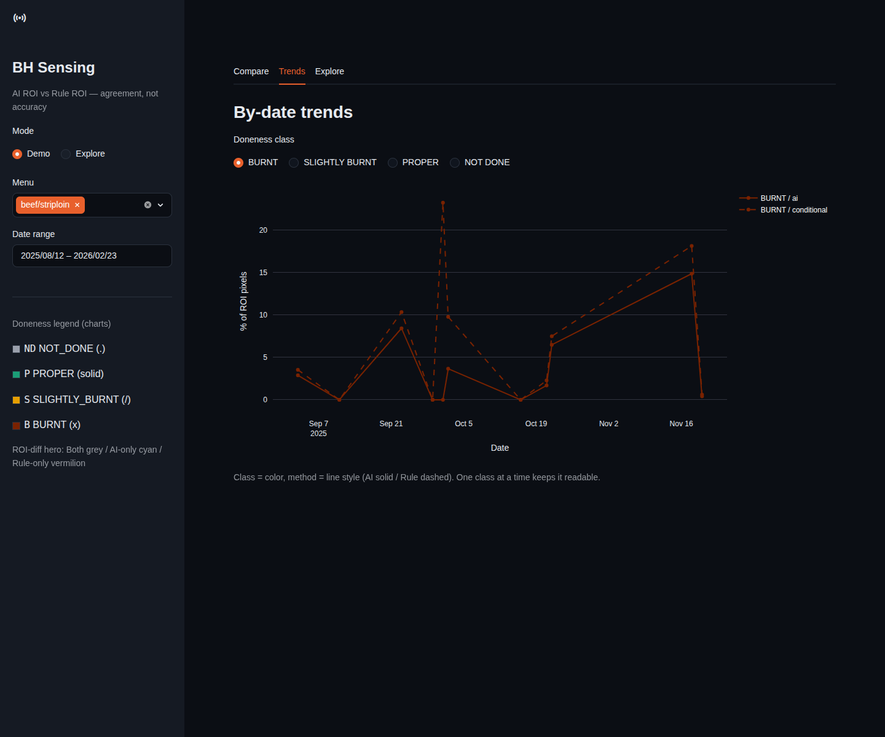
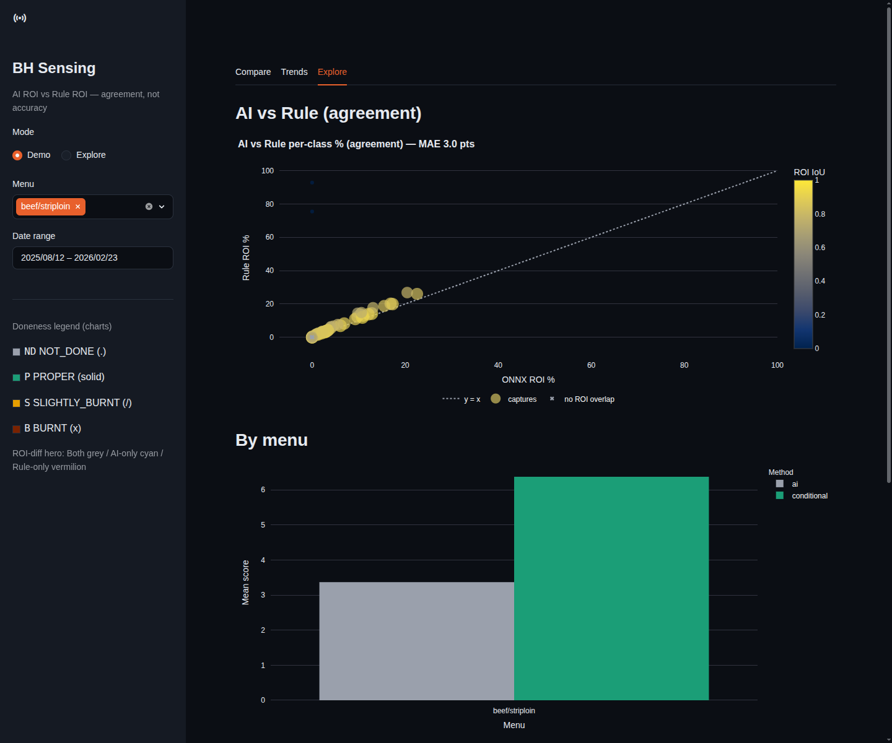

# BH Sensing 대시보드 사용설명서

> 숯불(charbroiler) 위 고기를 여러 파장으로 찍은 흑백 스펙트럼 이미지에서,
> **고기 영역(ROI)을 두 가지 방법으로 찾아 비교**하는 분석 도구입니다.
> 이 문서는 처음 쓰는 분도 따라 할 수 있도록 화면 하나하나를 설명합니다.

---

## 1. 이 도구는 무엇인가요?

같은 고기 사진에서 "어디가 고기인가(ROI)"를 두 방식으로 찾습니다.

| 방식 | 이름 | 고기 영역을 찾는 방법 |
|------|------|----------------------|
| AI | **ONNX ROI** | meatSegNet 신경망이 고기를 분할(segmentation) |
| 규칙 | **Rule ROI** | 파장 임계값 규칙 + 모폴로지로 고기 영역을 근사 |

- **두 방식은 "굽기 판정 규칙"이 완전히 똑같습니다.** 다른 것은 *고기 영역을 찾는 방법*뿐입니다.
- 그래서 이 도구는 "어느 쪽이 더 정확한가"가 아니라, **"두 방식이 어디서 같고 어디서 다른가(일치도, agreement)"** 를 보여줍니다.
- ⚠️ 이 데이터에는 정답 라벨이 없습니다. 그래서 **"정확도(accuracy)"가 아니라 "일치도(agreement)"** 라는 말만 씁니다. (자세한 이유는 7장)

---

## 2. 준비물 (이미 되어 있음)

- Python 실행 환경(`.venv`)은 이미 구성되어 있어 추가 설치가 필요 없습니다.
- `data/` 폴더에 스펙트럼 이미지, `ai_model/` 폴더에 AI 모델이 있어야 합니다. (이미 있음)

---

## 3. 실행 방법 (가장 쉬운 방법)

터미널에서 프로젝트 폴더로 이동한 뒤 **한 줄**만 입력하세요.

```bash
bash run.sh
```

이 명령은 두 단계를 자동으로 실행합니다.

1. **점수 계산(파이프라인)** — `data/`를 읽어 두 방식으로 채점하고 `scores.duckdb`에 저장합니다.
2. **대시보드 실행** — 웹 화면으로 결과를 보여줍니다. 보통 주소는 **http://localhost:8501** 입니다.

> 💡 **빠르게 보고 싶다면** `bash demo.sh` 를 쓰세요. 적은 수만 채점하고 바로 대시보드를 엽니다.
>
> 💡 처음 실행하면 점수 계산에 시간이 걸립니다. 브라우저가 자동으로 안 열리면, 터미널에 찍힌 `Local URL` 주소를 복사해서 브라우저에 붙여 넣으세요.

실행을 멈추려면 터미널에서 `Ctrl + C` 를 누릅니다.

---

## 4. 화면 한눈에 보기

### 4.1 왼쪽 사이드바 (항상 보이는 메뉴)

- **Mode (모드)**
  - **Demo** — (추천) 미리 골라 둔 대표 capture를 자동으로 보여줍니다. 표를 뒤질 필요가 없습니다.
  - **Explore** — 직접 메뉴/날짜를 골라 capture를 탐색합니다.
- **Menu (메뉴)** — 분석할 메뉴를 고릅니다. **여러 개 선택**할 수 있습니다.
- **Date range (날짜 범위)** — 기간을 좁혀서 봅니다.
- **Doneness legend (굽기 색 범례)** — 차트에서 쓰는 4단계 색:
  - **ND** NOT_DONE(안 익음) — 회색
  - **P** PROPER(딥 마이야르) — 초록
  - **S** SLIGHTLY_BURNT(살짝 탐) — 주황
  - **B** BURNT(탄 부분) — 진한 빨강
  - 색맹인 분도 구분할 수 있도록 **글자칩(ND/P/S/B) + 무늬(점·빗금·X)** 를 함께 씁니다.

### 4.2 Compare 탭 — 가장 중요한 화면



- **ROI-diff 오버레이맵 (hero)** — 흑백 고기 이미지 위에 세 가지 색으로 두 ROI의 차이를 보여줍니다.
  - **회색** = 두 방식이 *모두* 고기로 본 영역 (일치)
  - **하늘색(cyan)** = *AI만* 고기로 본 영역
  - **주황색** = *규칙만* 고기로 본 영역
  - 아래 캡션: "Same doneness rules. Different ROI mask." (= 굽기 규칙은 같고, 고기 마스크만 다르다)
- **점수 카드 (KPI)** — hero 바로 아래 세 숫자:
  - **IoU** — 두 영역이 얼마나 겹치는지(0~1, 1에 가까울수록 일치). 예: `IoU 0.89` 면 상당히 겹친다는 뜻.
  - **Dice** — 겹침을 다르게 잰 값(완전 일치 부근에서 더 민감).
  - **Area delta (px)** — 두 영역의 면적 차이(부호 포함, 중립색).
  - 캡션 해석 기준: **IoU ≥ 0.90 → 강한 일치**, **0.75~0.90 → 상당 부분 겹침(경계만 다름)**, 그 미만 → 두 영역이 갈림.
- **Demo 6단계 설명** — Demo 모드에서는 발표용 6단계 캡션이 함께 표시됩니다(① 도입 → ② 원본 프레임 → ③ hero 공개 → ④ 한 숫자 → ⑤ 의미 → ⑥ 마무리).
- **Per-panel detail (접힌 상세)** — 클릭해서 펼치면 자세한 비교가 나옵니다.



  - **원본 | AI 오버레이 | 규칙 오버레이** 3분할 이미지
  - **4단계 누적 막대** — AI ROI와 Rule ROI 각각의 굽기 분포(ND/P/S/B, 합이 100%)
  - **클래스별 % + 절대 픽셀 수** — 예: `B 6% (1989 px)`. %만 보면 과장될 수 있어 실제 픽셀 수를 항상 같이 보여줍니다.

### 4.3 Trends 탭 — 날짜별 추이



- 선택한 **굽기 클래스**(BURNT 등)의 날짜별 평균 %를 선 그래프로 봅니다.
- **색 = 클래스**, **선 스타일 = 방법**(AI 실선 / 규칙 점선).
- 맨 위 라디오 버튼(BURNT / SLIGHTLY BURNT / PROPER / NOT DONE)으로 보고 싶은 클래스를 바꿉니다.
- 화면이 복잡해지지 않도록 한 번에 한 클래스만 보여줍니다.

### 4.4 Explore 탭 — 자세히 탐색



- **AI vs Rule 산점도** — 점이 `y=x` 점선에 가까울수록 두 방식이 일치합니다. 점 색/크기 = ROI IoU(겹침). 오른쪽 색막대(ROI IoU)로 색의 의미를 읽습니다.
  - 겹치는 영역이 전혀 없는 capture는 아래 범례의 **"no ROI overlap"** 표시(✕)로 따로 나옵니다.
- **By menu (메뉴별 막대)** — 선택한 메뉴들의 방법별 평균 점수. 여러 메뉴를 한 번에 비교하려면 **사이드바 Menu에서 메뉴를 추가로 선택**하세요(기본은 한 메뉴만 보여 줍니다).
- **Captures (capture 표)** — 표의 한 줄을 클릭하면, **Explore 모드**일 때 그 capture가 Compare 탭의 hero로 표시됩니다.

---

## 5. 명령어 옵션 (고급 사용자)

`run.sh` 대신 직접 파이프라인을 돌릴 수 있습니다.

```bash
python cli/run_pipeline.py [--limit N] [--methods ai|conditional|both] [--data-root DIR] [--db PATH]
```

| 옵션 | 설명 | 기본값 |
|------|------|--------|
| `--limit N` | 앞에서 N개 capture만 채점(빠른 테스트) | 전체 |
| `--methods` | 어떤 방식을 돌릴지 (`ai` / `conditional` / `both`) | `both` |
| `--data-root` | 스캔할 폴더 | `data` |
| `--db` | 결과 DB 경로 | `scores.duckdb` |

예) 일부만 빠르게 채점: `python cli/run_pipeline.py --limit 20 --methods both`

대시보드만 따로 실행: `streamlit run app/dashboard.py`

---

## 6. 자주 묻는 질문 / 문제 해결

- **"아직 점수가 없습니다(No scores yet)" 화면이 떠요.**
  → 아직 채점을 안 했습니다. 먼저 `bash run.sh` 를 실행하세요.

- **pork/chicken 같은 메뉴는 AI 영역이 0으로 나와요.**
  → 정상입니다. AI 전체 점수는 **소고기(beef) 영역만** 합산하도록 원본 엔진을 그대로 따랐기 때문입니다. 소고기가 아닌 메뉴는 AI ROI가 0이 될 수 있습니다(규칙 ROI 위주로 보세요).

- **"Rule ROI is empty" / "AI ROI is empty" 경고가 떠요.**
  → 그 capture에서 해당 방법이 고기 영역을 찾지 못한 경우입니다. 비어 있으면 IoU는 정의되지 않으므로 경고로 알려 줍니다(오류 아님).

- **대시보드를 켜 둔 채 다시 `run.sh` 를 돌렸더니 DB 잠금(lock) 오류가 나요.**
  → 대시보드(읽기)와 파이프라인(쓰기)이 같은 DB를 동시에 잡으면 충돌합니다. **대시보드를 끈 뒤 → 파이프라인 실행 → 다시 대시보드** 순서로 하세요. (`run.sh` 가 이 순서대로 합니다.)

- **메뉴/날짜를 바꿨더니 차트가 비어요.**
  → 사이드바 필터가 해당 데이터를 제외했을 수 있습니다. Menu 선택과 Date range를 넓혀 보세요.

- **브라우저가 안 열려요.**
  → 터미널에 표시된 `Local URL`(예: http://localhost:8501)을 직접 브라우저에 입력하세요.

---

## 7. 핵심 개념 — 왜 "정확도"가 아니라 "일치도"인가요?

- 이 데이터에는 **정답(라벨)이 없습니다.** 그래서 "AI가 더 정확하다 / 더 낫다"고 증명할 수 없습니다.
- 두 방식은 **굽기 판정 규칙이 완전히 동일**하고, **고기 영역을 찾는 방법만** 다릅니다.
- 따라서 이 도구가 보여 주는 것은 **"같은 규칙으로, 두 방식이 고른 영역이 얼마나 겹치는가(일치도)"** 입니다.
- 모든 차이는 **부호(+/−)만 중립색**으로 표시하고, 어느 쪽이 "이겼다"고 표기하지 않습니다. 이것이 정직한 비교 방식입니다.

---

## 한 장 요약

1. `bash run.sh` → 잠시 기다림 → 브라우저에서 대시보드 확인
2. **Compare 탭**에서 hero(회색=일치 / 하늘색=AI만 / 주황=규칙만)와 IoU를 본다
3. **Trends/Explore 탭**에서 날짜별 추이와 메뉴별 비교를 본다
4. 숫자는 "정확도"가 아니라 **"일치도"** 로 읽는다
